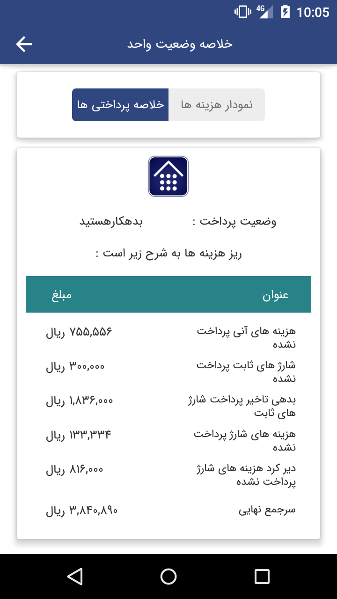
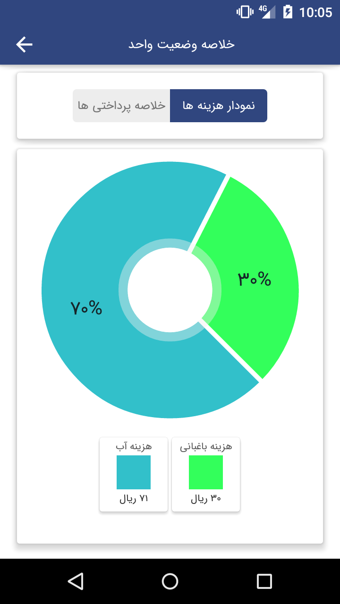
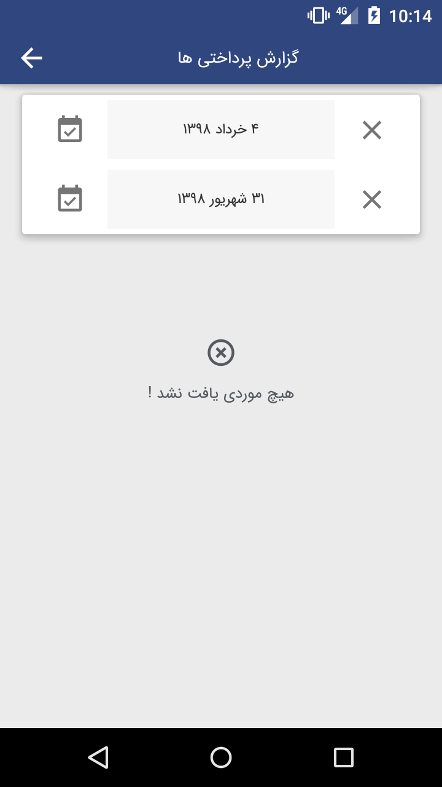
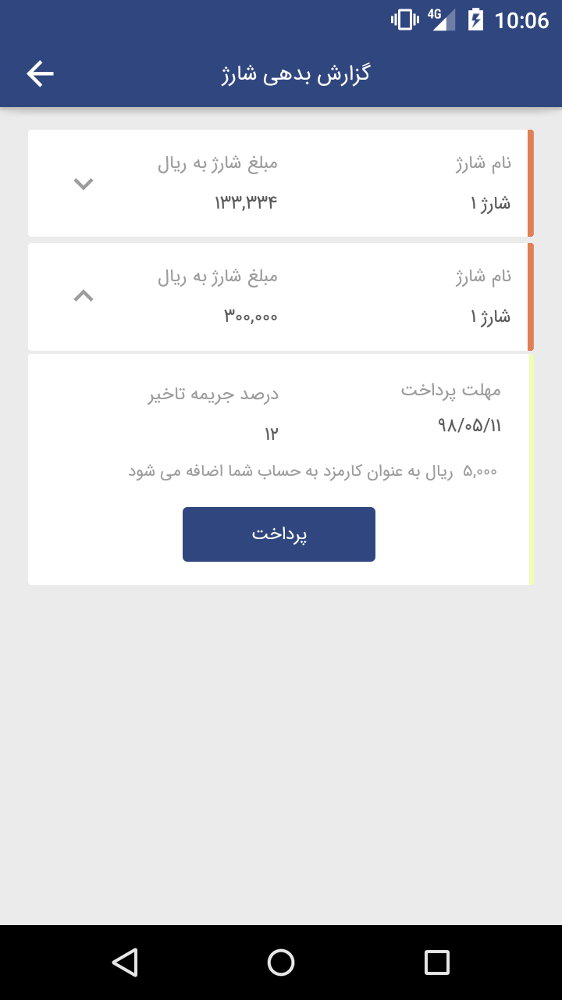
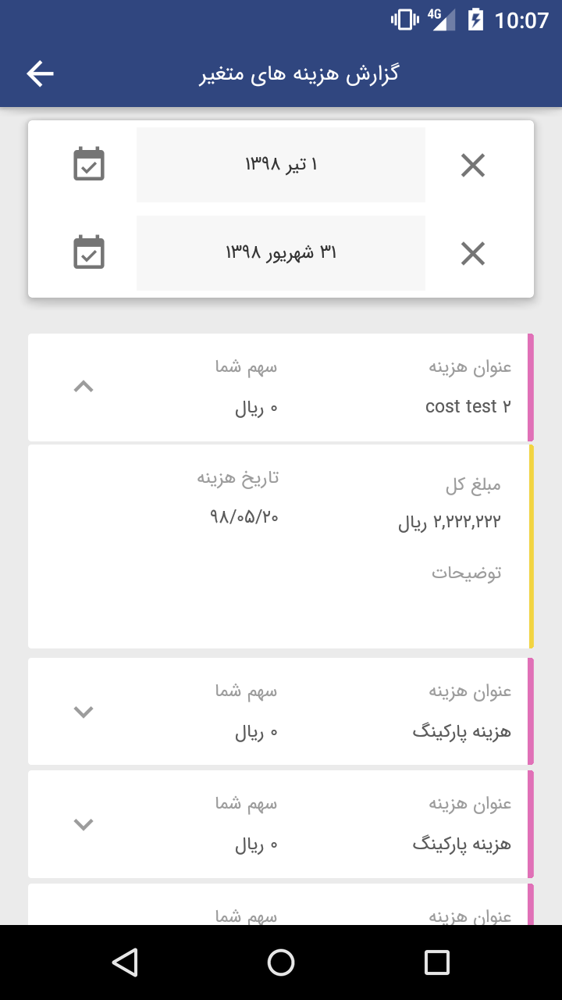
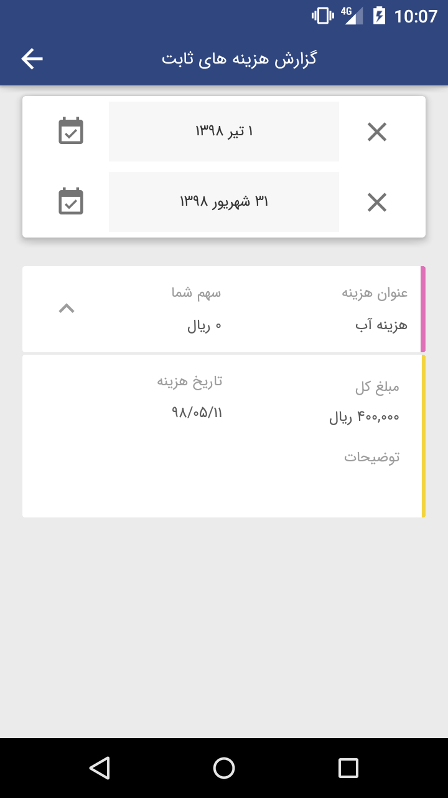
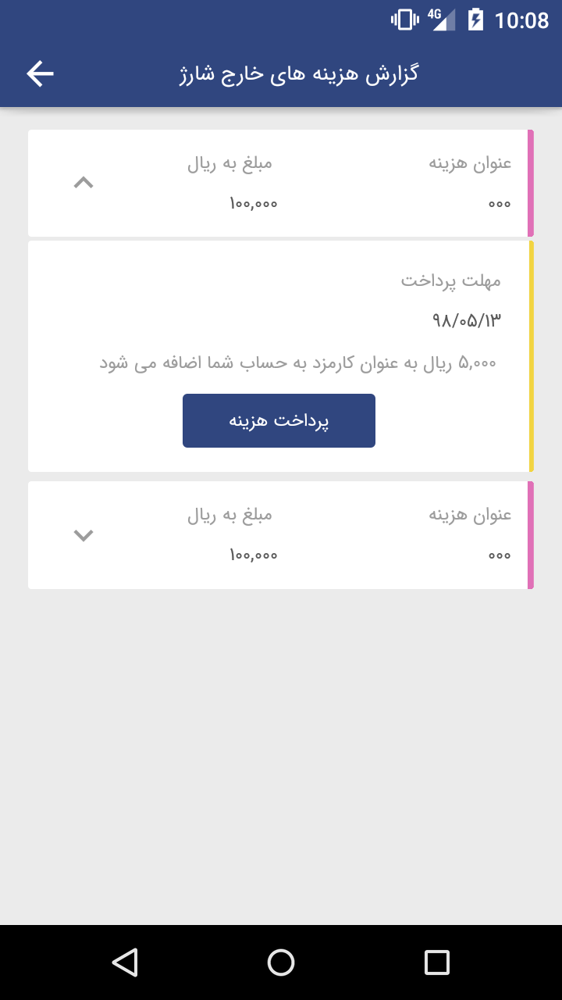

#  
# اسکرین های بخش ساکن به تفکیک  عکس و پارامتر های درخواستی
پارامتر های که دارای مقدار هستن  در جلوی آنها متغیر هست و دقیقا متغیر درست ارسال می شود #.# #

 
 
 

# operator:"chart" 
type: "unitstatus", 
buildingID: buildingID,   //  شناسه ساختمانی که واحد در ان قرار دارد
 unitID: ID //  شناسه واحد

------------------------------------------------------------------------------------------------------------------------------

# operator:"chart"  
 type: "unitpercent", 
 buildingID: buildingID,  //  شناسه ساختمانی که واحد در ان قرار دارد
  unitID: ID, // شناسه واحد  
  status: "محاسبه شده"
 
 ------------------------------------------------------------------------------------------------------------------------------

# operator:"getcostnot" 
 userID: unit.typeuser,  //   نوع مالکیت. یعنی ساکن یا 
                                    // مالک.
                                    // نام پارامتر غلط انداز است ولی در نقش
                                    // typeyser or // usertype
                                    // به کار می رود
                                    //
                                     
 buildingID: unit.buildingID,  //شناسه ساختمانی که واحد در ان قرار دارد
   unitID: unit.ID, // شناسه واحد
 ID: "", 
 type:'', 
 status: "پرداخت شده",  
 time1: unix1, //تاریخ اول بر حسب یونیکس
  time2: unix2 // تاریخ دوم
------------------------------------------------------------------------------------------------------------------------------

# operator:"getcostnot" 
  userID: unit.typeuser,       
                                     // نوع مالکیت. یعنی ساکن یا 
                                    // مالک.
                                    // نام پارامتر غلط انداز است ولی در نقش
                                    // typeyser or // usertype
                                    // به کار می رود
                                    // 
 typeuser:unit.typeuser,     // مشابه بالا می باشد. به علت نبود داکیو منت منسجم
                            //.در این درخواست به سرور هر دو را می فرستم                                    
   buildingID: unit.buildingID, //شناسه ساختمانی که واحد در ان قرار دارد 
  unitID: unit.ID, //شناسه واحد
   type: "", 
  ID: "", 
  status: "پرداخت نشده", 
  time1: "", 
  time2: ""

------------------------------------------------------------------------------------------------------------------------------

طی جلسه ای که برگزار شد. اقای قنبری گفتن که تمام ساکنین و مالکین بتوانند کل هزینه های ساختمان را رویت کنند
بنابراین فیلتر ای روی پارامتر ها نگذاشته شده

چیزی که باید توجه بشه اینه که تو صفحه و در آیتم های نوشته سهم شما. در حالیکه هیج پارامتری برای مشخص کردن طرف نیست که سرور گزارش رو بر اساس آن نفر بفرستد.

# operator:"getcost" 
ID: "", 
unitID: "", 
costID: "", 
buildingID: unit.buildingID,  // شناسه ساختمان که واحد در آن است
 type: "هزینه", 
time1:  unix1, //تاریخ اول
 time2:  unix2,  // تاریخ دوم بر حسب یونیکس
 status: "محاسبه شده", 
typeuser:"", 
chargeeffect:'' 
          

# operator:"getcost" 
 ID: "", 
 unitID: "", 
 costID: "", 
 buildingID:  unit.buildingID, //شناسه ساختمانی که واحد در آن است
  type: "هزینه ثابت", 
 time1:  unix1,  //تاریخ اول
  time2:  unix2,  //تاریخ دوم
  status: "محاسبه شده", 
 typeuser:'' 

 
 
 

# operator:"getcostnot" 
 typeuser: unit.typeuser,  //نوع واحد. ساکن یا مالک 
  userID:unit.typeuser,  // نوع واحد.   مالک یا ساکن
  buildingID: unit.buildingID,  //شناسه ساختمانی که واحد در آن است
  unitID: unit.ID,  //شناسه ساختمان
 ID: "", 
 status: "پرداخت نشده", 
 time1: "", 
 time2: "", 
 type:"آنی"
